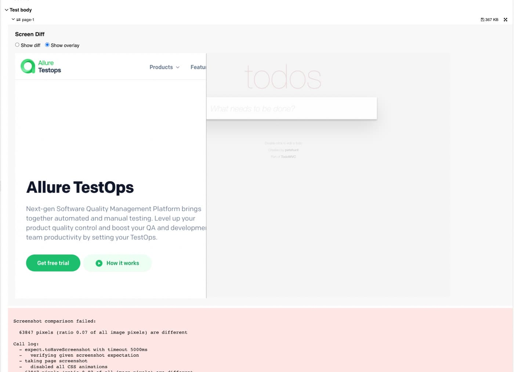

# allure-playwright

> Allure framework integration for [Playwright Test](https://playwright.dev) framework

[](https://allurereport.org "Allure Report")

- Learn more about Allure Report at https://allurereport.org
- 📚 [Documentation](https://allurereport.org/docs/) – discover official documentation for Allure
  Report
-

❓ [Questions and Support](https://github.com/orgs/allure-framework/discussions/categories/questions-support) –
get help from the team and community

-

📢 [Official annoucements](https://github.com/orgs/allure-framework/discussions/categories/announcements) –
be in touch with the latest updates

-

💬 [General Discussion ](https://github.com/orgs/allure-framework/discussions/categories/general-discussion) –
engage in casual conversations, share insights and ideas with the community

---

## Installation

Use your favorite node package manager to install the package:

```bash
npm i -D allure-playwright
```

## Usage

Just add `allure-playwright` into Playwright configuration file:

```js
module.exports = {
  reporter: "allure-playwright",
}
```

Or use the reporter with another ones:

```js
module.exports = {
  reporter: [["line"], ["allure-playwright"]];
}
```

Or pass the same value via command line:

```bash
npx playwright test --reporter=line,allure-playwright
```

Specify location for allure results:

Mac / Linux

```bash
ALLURE_RESULTS_DIR=my-allure-results npx playwright test --reporter=line,allure-playwright
```

Windows

```bash
set ALLURE_RESULTS_DIR=my-allure-results
npx playwright test --reporter=line,allure-playwright
```

Generate Allure Report:

```bash
allure generate my-allure-results -o allure-report --clean
```

Open Allure Report:

```bash
allure open allure-report
```

## Reporter options

Some reporter settings can set by following options:

| Option       | Description                                                                  | Default            |
|--------------|------------------------------------------------------------------------------|--------------------|
| outputFolder | Path to results folder.                                                      | `./allure-results` |
| detail       | Hide `pw:api` and `hooks` steps in report. [See below](#hooks-and-api-calls) | `true`             |
| suiteTitle   | Use test title instead of `allure.suite()`. [See below](#suit-title)         | `true`             |
| links        | Allure Runtime API links templates. [See below](#links-usage)                | `undefined`        |

### Options Usage

```js
module.exports = {
  reporter: [
    [
      "allure-playwright",
      {
        detail: true,
        outputFolder: "my-allure-results",
        suiteTitle: false,
      },
    ],
  ],
};
```

### Options for Allure TestOps compatibility

After exporting test results into Allure TestOps, the results may contain extra steps with
Playwright’s API calls, as
well as collisions in the name of the suits.

#### Hooks and API calls

By default, each step of the `test.step()` functions contains subsections Playwright’s API methods
calls.

The report looks like:

```text
> Before Hooks
  > browserContext.newPage

> Open example.com
  > page.goto( https://example.com/)

> Expect page text
  > expect.toBeVisible

> After Hooks
  > browserContext.close
```

To hide steps with `Before / After hooks` and API calls `page / expect / browser` set the
option `detail: false`

#### Suite title

By default, the reporter uses the test file path as the suite name.

If tests uses the `allure.suite()` and it's value must be used in Allure TestOps custom fields, then
set the option `suiteTitle: false`

## Providing extra information

Tests extra information can be provided by labels:

- label
- link
- id
- epic
- feature
- story
- suite
- parentSuite
- subSuite
- owner
- severity
- tag
- issue
- tms

### Labels Usage

```js
import { test, expect } from "@playwright/test";
import { label } from "allure-js-commons";

test("basic test", async ({page}, testInfo) => {
  await label("labelName", "labelValue");
});
```

### Links Usage

```js
import { test, expect } from "@playwright/test";
import { link, issue } from "allure-js-commons";

test("basic test", async ({ page }, testInfo) => {
  await link("https://playwright.dev", "link-type", "playwright-site"); // link with name and type
  await issue("Issue Name", "https://github.com/allure-framework/allure-js/issues/352");
});
```

You can also configure links formatters to make usage much more convenient. `%s`
in `urlTemplate` parameter will be replaced by given value.

```diff
module.exports = {
  reporter: [
    [
      "allure-playwright",
      {
        detail: true,
        outputFolder: "my-allure-results",
+        links: [
+          {
+            type: "issue",
+            urlTemplate: "https://example.org/issues/%s",
+            nameTemplate: "Issue: %s",
+          },
+          {
+            type: "tms",
+            urlTemplate: "https://example.org/tasks/%s"
+          },
+          {
+            type: "custom",
+            urlTemplate: "https://example.org/custom/%s"
+          },
+        ]
      },
    ],
  ],
};
```

Then you can assign link using shorter notation:

```js
import {test, expect} from "@playwright/test";
import {issue, tms, link} from "allure-js-commons";

test("basic test", async () => {
  await issue("Issue Name", "352");
  await tms("Task Name", "352");
  await link("352", "Link name", "custom");
});
```

### Id Usage

```js
import {test, expect} from "@playwright/test";
import {allure, LabelName} from "allure-playwright";

test("basic test", async ({page}, testInfo) => {
  await allure.id("420");
});
```

### Epics Usage

```js
import {test, expect} from "@playwright/test";
import {allure} from "allure-playwright";

test("basic test", async ({page}, testInfo) => {
  await allure.epic("Some Epic");
});
```

### Stories Usage

```js
import {test, expect} from "@playwright/test";
import {allure} from "allure-playwright";

test("basic test", async ({page}, testInfo) => {
  await allure.story("Some Story");
});
```

### Screenshot usage

```ts
import {test, expect} from "@playwright/test";
import {allure} from "allure-playwright";

test("basic test", async ({page}, testInfo) => {
  await allure.attachment("basic-page-screen", await page.screenshot(), {
    contentType: "image/png",
  });
});
```

### Attachments Usage

```js
import {test, expect} from "@playwright/test";
import {allure} from "allure-playwright";

export const TODO_ITEMS = ["buy some cheese", "feed the cat", "book a doctors appointment"];

test("basic test", async ({page}, testInfo) => {
  await allure.attachment("TODO_ITEMS", JSON.stringify(TODO_ITEMS), {
    contentType: "application/json",
  });
});
```

### Steps usage

```ts
import {test, expect} from "@playwright/test";
import {allure} from "allure-playwright";

export const TODO_ITEMS = ["buy some cheese", "feed the cat", "book a doctors appointment"];

test("basic test", async ({page}, testInfo) => {
  await allure.step("Visit todolist page", async () => {
    await page.goto("https://demo.playwright.dev/todomvc");
  });

  await allure.step("Create 1st todo.", async () => {
    await page.locator(".new-todo").fill(TODO_ITEMS[0]);
    await page.locator(".new-todo").press("Enter");
  });

  await expect(
    page.locator(".view label"),
    "Make sure the list only has one todo item.",
  ).toHaveText([TODO_ITEMS[0]]);
});
```

### Parameters usage

```ts
import {test, expect} from "@playwright/test";
import {allure} from "allure-playwright";

test("basic test", async ({page}, testInfo) => {
  await allure.parameter("parameterName", "parameterValue");
});
```

Also parameter takes an third optional parameter with the hidden and excluded options:
`mode: "hidden" | "masked"` - `masked` hide parameter value to secure sensitive data, and `hidden`
entirely hide parameter from report

`excluded: true` - excludes parameter from the history

```ts
import {test, expect} from "@playwright/test";
import {allure} from "allure-playwright";

test("basic test", async ({page}, testInfo) => {
  await allure.parameter("parameterName", "parameterValue", {mode: "masked", excluded: true});
});
```

### Selective test execution

Allure allow you to execute only a subset of tests. This is useful when you want to run only a
specific test or a group of tests.

To enable this feature, you need to add the following code to your `playwright.config.js`:

```diff
+ import { testPlanFilter } from "allure-playwright/dist/testplan";
export default {
  reporter: [
    [
      "allure-playwright",
    ],
  ],
  projects: [
    {
      name: "chromium",
    },
  ],
+  grep: testPlanFilter()
};
```

Allure will read `ALLURE_TESTPLAN_PATH` environment variable and read testplan from the specified
file.

### EnvironmentInfo usage

Allure allows you to add environment information to the report. This is useful when you want to add
some additional information to the report.

to enable this feature, you need to add the following field to your `playwright.config.js`:

```diff
export default {
  reporter: [
    [
      "allure-playwright",
      {
+        environmentInfo: {
+          E2E_NODE_VERSION: process.version,
+          E2E_OS: process.platform,
+        },
      },
    ],
  ],
};
```

### Visual comparisons usage

Allure allows you to add visual comparisons to the report. This is useful when you want to add some
additional information to the report.

```ts
import {test, expect} from "@playwright/test";

test("screendiff", async ({page}) => {
  await page.goto("https://playwright.dev/");
  await expect(page).toHaveScreenshot();
});
```

If screenshots don't match, the report shows difference between them.



### Passing metadata from test title

You also can pass allure metadata from test title.
This is useful when you need to set allureId for the tests with failing before hooks. Just
add `@allure.id={idValue}` for the allureId or `@allure.label.{labelName}={labelValue}` for other
types of labels.

```ts
import {test, expect} from "@playwright/test";

test("test with allureId @allure.id=256", async ({}) => {
});
test("tst with severity @allure.label.severity=critical", async ({}) => {
});
test("test with epic @allure.label.epic=login", async ({}) => {
});
test("test with strangeLabel @allure.label.strangeLabel=strangeValue", async ({}) => {
});
```

> **Warning**
> Note that changing title can cause creating new testcases in history.
> To fix this please add `@allure.id={yourTestCaseId}` to the test name if you passing allure
> metadata from test title
