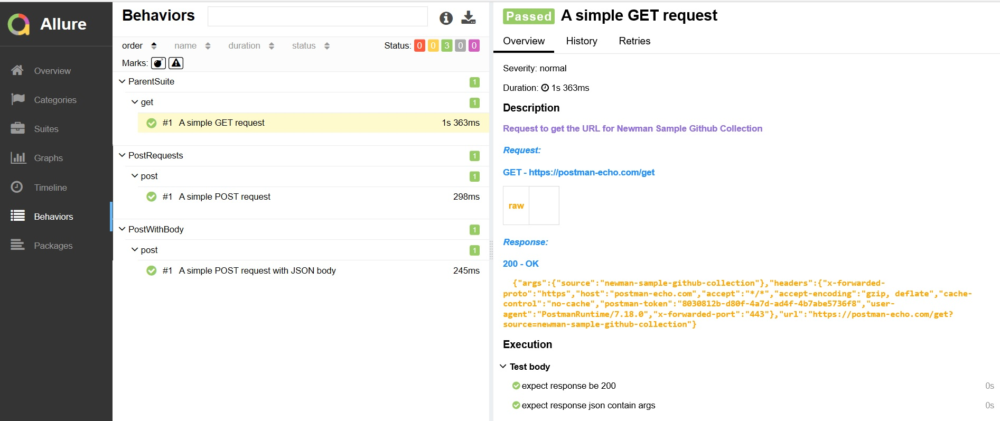

# newman-reporter-allure
A newman reporter for generating nice and clean report using Allure-js framework

## Installation
```console
$ npm install -g newman-reporter-allure
```

## Usage
To generate Allure results, specify `allure` in Newman's `-r` or `--reporters` option.

```console
$ newman run <Collection> -e <Environment> -r allure
$ newman run <Collection> -e <Environment> -r allure --reporter-allure-export <allure-results-out-dir>
```

Use the option `--report-allure-collection-as-parent-suite` to use the collection name as the parent suite title under the _Suites_ view. This helps when you run multiple collections and want to aggregate them in a single report.

## Generating and Serving Allure report

Allure results will be generated under folder "allure-results" in the root location.
Use allure-commandline to serve the report locally.
  ```console
  $ allure serve
  ```
Generate the static report web-application folder using allure-commandline 
 ```console
  $ allure generate --clean
  ```
  Report will be generated under folder "allure-report" in the root location.


